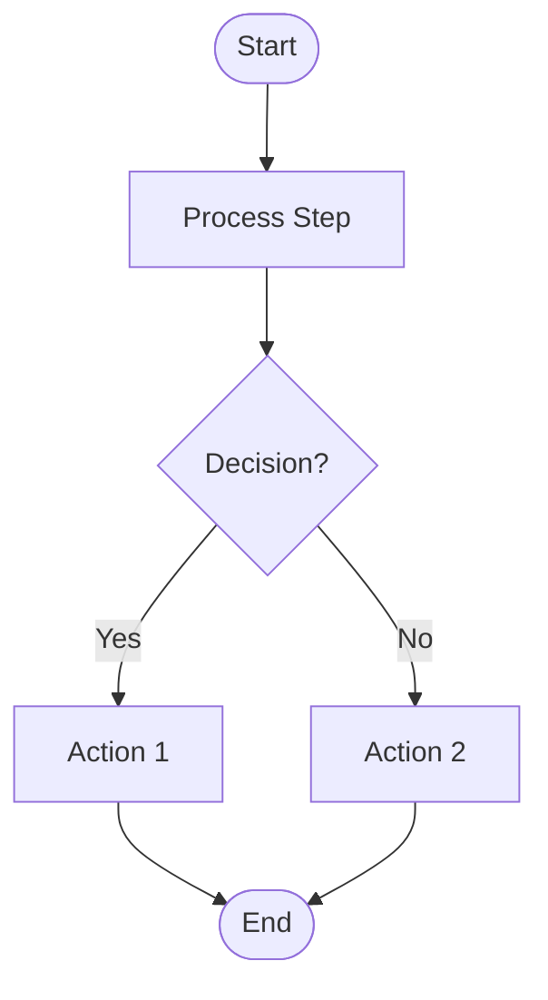
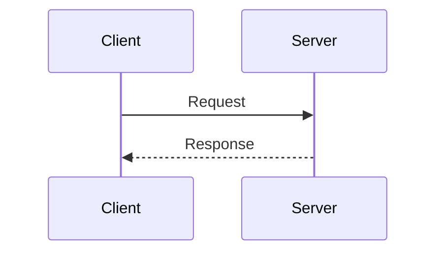
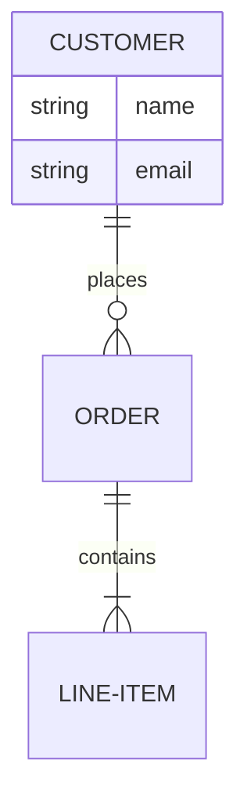

# BMAD Diagram Converter CLI

Standalone command-line tool for converting Mermaid diagrams to **Draw.io XML** and **Markdown documentation**.

## Features

- 🔄 **Mermaid → Draw.io XML**: Convert flowcharts, sequence diagrams, and ER diagrams
- 📝 **Mermaid → Markdown**: Generate structured documentation from diagrams
- ✅ **Validation**: Check Mermaid syntax and Draw.io compatibility
- 📊 **Multiple diagram types**: Flowcharts, sequence diagrams, ER diagrams
- 🎨 **Auto-styling**: Automatic shape mapping and color assignment

## Installation

The CLI is included in the BMAD-METHOD package. No additional installation required.

```bash
# From the repository root
cd tools/cli/diagram-converter
```

## Usage

### Commands

#### Convert to Draw.io XML

```bash
node diagram-cli.js to-drawio <file.mmd> [-o output.drawio]
```

Options:
- `-o, --output <file>` - Output file path (default: stdout or auto-named)
- `-n, --name <name>` - Diagram name in Draw.io
- `-q, --quiet` - Suppress info messages

#### Convert to Markdown

```bash
node diagram-cli.js to-markdown <file.mmd> [-o output.md]
```

Options:
- `-o, --output <file>` - Output file path (default: stdout or auto-named)
- `-q, --quiet` - Suppress info messages

#### Full Conversion (Both Outputs)

```bash
node diagram-cli.js convert <file.mmd> [-d output-dir]
```

Options:
- `-d, --output-dir <dir>` - Output directory (default: current)
- `-n, --name <name>` - Diagram name
- `-q, --quiet` - Suppress info messages

#### Validate Mermaid

```bash
node diagram-cli.js validate <file.mmd> [--json]
```

Options:
- `-o, --output <file>` - Output validation report as Markdown
- `--json` - Output as JSON
- `-q, --quiet` - Quiet mode, exit with code only

### Examples

```bash
# Convert flowchart to Draw.io
node diagram-cli.js to-drawio flowchart.mmd -o flowchart.drawio

# Generate documentation
node diagram-cli.js to-markdown sequence.mmd -o sequence-docs.md

# Full conversion with all outputs
node diagram-cli.js convert er-diagram.mmd -d ./output

# Validate before conversion
node diagram-cli.js validate diagram.mmd --json

# Read from stdin
cat diagram.mmd | node diagram-cli.js to-drawio - -o output.drawio
```

## Supported Diagram Types

### Flowcharts



Supported shapes:
- `[ ]` - Rectangle
- `( )` - Rounded rectangle
- `{ }` - Diamond (decision)
- `[[ ]]` - Subroutine
- `([ ])` - Stadium (terminal)
- `(( ))` - Circle

### Sequence Diagrams



### ER Diagrams



## Output Formats

### Draw.io XML

The generated `.drawio` file can be:
- Opened at [app.diagrams.net](https://app.diagrams.net)
- Edited with the VS Code Draw.io extension
- Imported into Confluence, Notion, etc.

### Markdown

The generated Markdown includes:
- Diagram overview and type
- Entity/node table with shapes
- Relationship/edge table
- Subgraph documentation
- Original Mermaid code for reference

## Programmatic Usage

You can also use the converter as a library:

```javascript
const { parseMermaid, toDrawio, toMarkdown } = require('./diagram-converter');

const mermaidCode = `
flowchart TD
    A[Start] --> B[End]
`;

// Parse
const parsed = parseMermaid(mermaidCode);
console.log(parsed.nodes); // [{id: 'A', label: 'Start', ...}, ...]

// Convert to Draw.io XML
const xml = toDrawio(parsed, { name: 'My Diagram' });

// Convert to Markdown
const markdown = toMarkdown(parsed, mermaidCode);
```

## Conversion Rules

The CLI follows the BMAD Diagram Converter agent's ruleset:

1. **Node IDs**: Alphanumeric with underscores only
2. **Arrows**: Simple arrows (`-->`, `---`)
3. **Direction**: TD, LR, RL, BT
4. **Grid alignment**: Coordinates rounded to multiples of 10
5. **Unique IDs**: All Draw.io elements have unique IDs

## Limitations

- Complex styling (classDef, style) is not preserved in Draw.io
- Some advanced Mermaid features may not convert perfectly
- Chained arrows should be split into separate lines for best results

## License

MIT - Part of the BMAD-METHOD project
